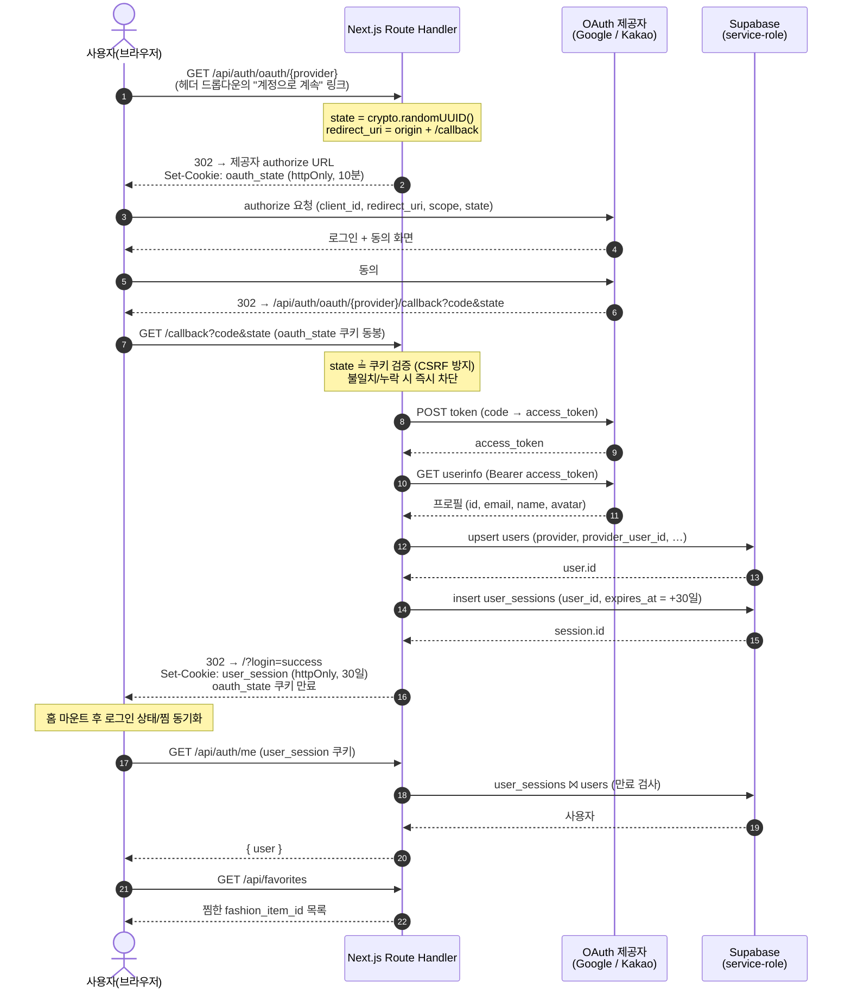
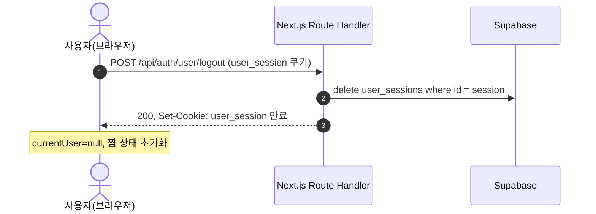

# 사용자 OAuth 2.0 로그인 시퀀스

일반 사용자 로그인은 자체 **Authorization Code** 플로우다. Supabase Auth 를 쓰지 않고
관리자 인증과 동일하게 자체 테이블(`users` / `user_sessions`) + httpOnly 쿠키 세션을 사용한다.

- 시작 라우트: [`app/api/auth/oauth/[provider]/route.ts`](../app/api/auth/oauth/[provider]/route.ts)
- 콜백 라우트: [`app/api/auth/oauth/[provider]/callback/route.ts`](../app/api/auth/oauth/[provider]/callback/route.ts)
- 서버 유틸: [`src/lib/server/user-auth.ts`](../src/lib/server/user-auth.ts), [`oauth-http.ts`](../src/lib/server/oauth-http.ts)
- 지원 제공자: `google`, `kakao`

## 로그인 플로우

### 단계 요약

1. **시작** — 사용자가 헤더 드롭다운에서 Google/카카오를 누르면 `GET /api/auth/oauth/{provider}` 로 이동한다. 서버는 일회용 `state` 를 만들어 `oauth_state` 쿠키(httpOnly·10분)에 심고, 제공자 동의 페이지로 302 리다이렉트한다.
2. **동의** — 사용자가 제공자에서 로그인·동의하면 제공자가 `code` 와 `state` 를 붙여 콜백으로 되돌려 보낸다.
3. **검증** — 콜백은 쿼리의 `state` 와 `oauth_state` 쿠키를 비교한다(CSRF 방지). 누락/불일치면 `?login=error` 로 차단한다.
4. **토큰 교환** — `code` 를 access token 으로 교환하고(`POST`), 그 토큰으로 사용자 프로필을 조회한다(`GET userinfo`).
5. **세션 발급** — 프로필을 `users` 에 upsert 하고 `user_sessions` 에 30일짜리 세션을 만든 뒤 `user_session` 쿠키를 내려준다. 일회용 `oauth_state` 쿠키는 만료시킨다.
6. **동기화** — 홈으로 돌아오면 Dashboard 가 `/api/auth/me` 로 로그인 상태를, `/api/favorites` 로 찜 목록을 불러온다.

## 실패·경계 처리

- 사용자가 동의를 거부하거나(`?error=…`), `code`/`state` 가 없거나, `state` 가 쿠키와 다르면 → `/?login=error` 로 리다이렉트하고 `oauth_state` 쿠키를 정리한다.
- 토큰 교환·userinfo·DB 작업 중 예외도 모두 `/?login=error` 로 수렴한다(서버 로그에 상세 기록).
- 세션 무효화는 `public.user_sessions` 행 삭제로 한다(서비스 키 회전과 무관). 로그아웃은 `POST /api/auth/user/logout` 가 세션 행 삭제 + 쿠키 만료를 수행한다.

## 로그아웃

